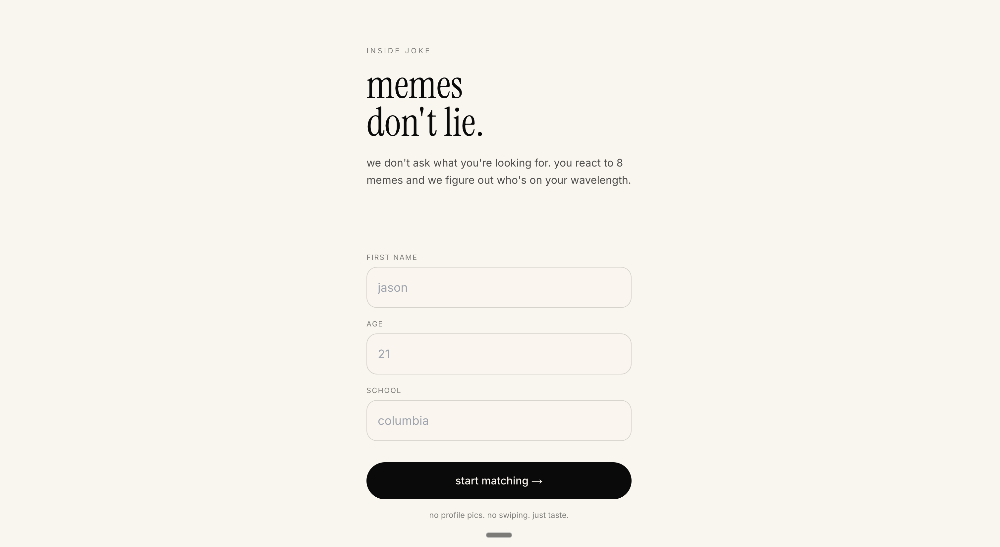

# Inside Joke

> Humor-based matching for an AI-native dating app. React to 8 memes; we figure out who's on your wavelength.

Built in ~90 minutes as a take-home for the **Ditto** Product Engineering internship.

<p align="center">
  
</p>

## Pitch

Young people don't know what they want from a dating app. Asking them to fill out preference forms produces idealized self-reports that miss what actually lands when two people meet. **Humor reactions are an indirect signal** — they reveal taste, attachment style, and worldview faster and more honestly than a bio ever could.

Humor compatibility is also one of the strongest predictors of relationship success — and meme reactions are a viral, shareable hook. So this feature solves both the matching-quality problem and the cold-start distribution problem at once.

## Architecture — agent pipeline

```
┌─────────────────┐
│ user reactions  │  (8 memes × {love | laugh | meh | cringe})
└────────┬────────┘
         │
         ▼
┌─────────────────────┐
│ humorProfileAgent   │  → { primaryStyle, secondaryStyle, vibes, description }
└────────┬────────────┘
         │
         ▼  (Promise.all — 4 parallel calls)
┌──────────────────────────────────────────────┐
│ compatibilityAgent  ×  4 seed profiles       │  → { score, overlap, tension }
└────────┬─────────────────────────────────────┘
         │  pick max(score)
         ▼
┌─────────────────────┐
│ matchReasoningAgent │  → 2-3 sentence Gen-Z explanation
└────────┬────────────┘
         │
         ▼
     match screen
```

Each agent is a thin wrapper around `generateObject` with a Zod schema, so every LLM output is fully typed end-to-end. The seed profiles' humor profiles are pre-baked into [data/seedProfiles.json](data/seedProfiles.json) — this saves 4 LLM calls per request and lets us tune seed personalities for interesting matching dynamics.

## Tech stack & decisions

| Layer | Choice | Why |
| --- | --- | --- |
| Framework | Next.js 14 App Router + TS | One process for UI + API. Server actions + RSC keep the agent pipeline server-side; no API key leakage. |
| Styling | Tailwind, no UI lib | Fastest path to a polished mobile-first surface in 90 min. |
| LLM | Vercel AI SDK + `gpt-4o-mini` | `generateObject` + Zod gives typed structured output for free; 4o-mini keeps latency ~3-5s for 6 calls. |
| State | React Context + `useReducer` | "React state only" constraint; cleaner than `sessionStorage` and easy to lift to Redux/Zustand later. |
| Persistence | None (seeded JSON) | Demo. Production wants Postgres + Redis (see "What I'd build next"). |

## Run locally

```bash
# 1. install
npm install

# 2. add your OpenAI key
echo "OPENAI_API_KEY=sk-..." > .env.local

# 3. (optional) drop 8 images named meme-1.jpg ... meme-8.jpg into public/memes/
#    if you skip this, the UI shows a styled placeholder card so the flow still demos cleanly.

# 4. run
npm run dev
# → http://localhost:3000
```

## File tour

```
app/
├── page.tsx              # onboarding (name, age, school)
├── memes/page.tsx        # one-meme-at-a-time reaction flow
├── match/page.tsx        # humor profile + matched seed + AI blurb
└── api/match/route.ts    # POST handler — runs the 3-agent pipeline

lib/
├── agents/
│   ├── humorProfileAgent.ts
│   ├── compatibilityAgent.ts
│   └── matchReasoningAgent.ts
├── context.tsx           # AppProvider (useReducer)
└── types.ts              # Zod schemas — single source of truth

data/
├── memes.json            # 8 memes tagged across 8 humor styles
└── seedProfiles.json     # 4 seed users w/ pre-baked humor profiles
```

Each agent file opens with a 5-line header describing its role in the chain so the architecture reads top-to-bottom.

## What I'd build next

- **Vibe matching** — a second axis beyond humor (energy level, social mode, weekend-coded vs weeknight-coded) so the score isn't one-dimensional.
- **Attachment-style signal** — pull from how reactions distribute across the love→cringe spectrum, not just which memes they hit on.
- **A/B testing harness** — measure whether humor-matched conversations actually outlast bio-matched ones (north-star metric: messages exchanged in the first 72h).
- **Postgres + Redis** — `users`, `meme_reactions`, `humor_profiles`, `compatibility_scores`. Cache compatibility scores in Redis (humor profiles change slowly, so this is a 99% hit rate).
- **Real meme ingestion pipeline** — auto-tag new memes via vision model, monitor reaction distributions to retire memes that stop differentiating.
- **Streaming** — stream the match-reasoning blurb token-by-token to the client so the wait feels alive.
- **Cold-start sharing hook** — let users post their humor profile to IG/TikTok; the recipient's reactions seed the matchmaker before they sign up.

## Notes

- This was built in roughly 90 minutes for a Ditto take-home. Tests, accessibility polish, real meme images, and prod auth are all cut for time. The goal was an end-to-end demo of the agentic narrative — onboarding → reactions → 3-stage LLM pipeline → personalized match — not a finished product.
